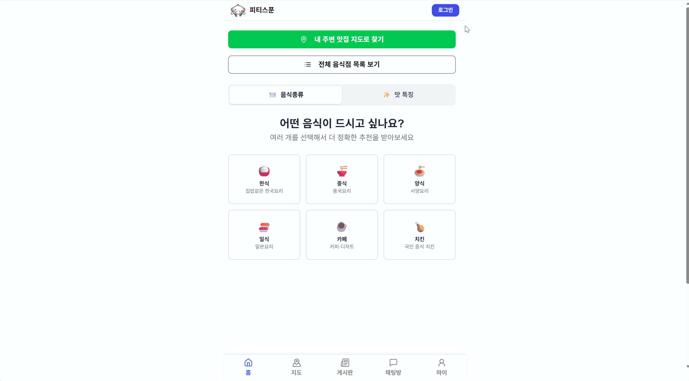

#  피티스푼 (PTspoon)
> **평택대학교 학생들을 위한 맛집 추천 및 로컬 커뮤니티 서비스**

**피티스푼**은 학교 주변의 숨은 맛집을 찾고, 학우들과 실시간으로 소통할 수 있는 웹 플랫폼입니다.  
사용자 취향 기반의 식당 추천부터 지도 탐색, 실시간 채팅, 그리고 AI 챗봇 '피투'까지 다양한 기능을 제공합니다.

 

### **배포 주소:** [https://restaurant-find-one.vercel.app](https://restaurant-find-one.vercel.app)

 

## 🛠️ Tech Stack

 

## 👥 Developers (개발팀)

<table width="100%">
  <thead>
    <tr>
      <th width="33%" align="center">👑 PM & Full Stack</th>
      <th width="34%" align="center">🎨 Main Developer</th>
      <th width="33%" align="center">🧪 QA & Branding & Developer</th>
    </tr>
  </thead>
  <tbody>
    <tr>
      <td align="center">
        
      </td>
      <td align="center">
        
      </td>
      <td align="center">
        
      </td>
    </tr>
    <tr>
      <td align="center">
        <b>이준희</b> 
        팀장 / 시스템 아키텍처  
        
          🏗️ <b>System Architecture</b> 
          Next.js 전역 레이아웃 및 구조 설계 
          DB 설계 (ERD) & 인증 (OAuth) 
          상단바, 네비게이션바 컴포넌트 제작 
           
          🤖 <b>AI & FULL Stack</b> 
          OpenAI 기반 맛집 추천 챗봇 
          실시간 채팅 기능 
          모든 게시글 관련 페이지 
          로그인/회원가입 페이지 
          웹 크롤링 및 식당 데이터 추가 
           
          🛡️ <b>Management</b> 
          알파 테스트 및 버그 수정 
          모바일 최적화 
        
      </td>
      <td align="center">
        <b>서승진</b> 
        메인 개발자  
        
          🧩 <b>Core Logic</b> 
          복합 필터링 알고리즘 (AND/OR) 
          Cross-Page 상태 관리 
           
          🗺️ <b>Map Service</b> 
          Geolocation & 마커 클러스터링 
          지도 인터랙션 & 바텀시트 
           
          🎨 <b>Design System</b> 
          UI 컴포넌트 라이브러리 구축 
          리뷰 작성 프로세스 UX
        
      </td>
      <td align="center">
        <b>김윤정</b> 
        프론트엔드 / QA 담당  
        
          💬 <b>Chat System UI</b> 
          채팅방 목록/생성 페이지 구현 
          카카오톡 스타일 메시지 UI 
           
          ✨ <b>Branding</b> 
          자체 캐릭터(피투) 및 로고 디자인 
           
          🐞 <b>QA & Testing</b> 
          베타 테스터 모집 및 운영 
          사용자 피드백 수집 및 개선 
        
      </td>
    </tr>
    <tr>
      <td align="center">
        
      </td>
      <td align="center">
        
      </td>
      <td align="center">
        
      </td>
    </tr>
  </tbody>
</table>

 

## 🏆 Awards
* **정보통신학과 공모전 우수상 수상**
 

## 🚀 Key Features

### 1️⃣ 로그인/회원가입 기능
| 로그인/회원가입 페이지(카카오톡 로그인 가능) | 
| :---: | 
|  | 
| 사용자가 원하는 방식으로 로그인/회원가입이 가능합니다. | 

 

### 2️⃣ 메인 & 식당 카테고리 필터와 리뷰 기능
| 메인 페이지 (카테고리 선택) | 
| :---: | 
|  | 
| 사용자의 취향(한식, 중식 등)과 특징(매콤한 맛 등)에 따라 메뉴를 추천합니다. OR 필터는 맛의 특징이 1개라도 포함이 되어있으면,  AND 필터는 맛의 특징이 모두 포함이 된 식당들만 표시됩니다. | 

|  식당 페이지 (리뷰 기능) | 
| :---: | 
|  | 
| 전체 식당 목록에서 원하는 식당을 클릭하여 정보 확인과 리뷰작성이 가능합니다. | 

 

### 3️⃣ 지도 기능
| 지도 페이지(실시간 위치, 필터링 기능) | 
| :---: | 
|  | 
| 실시간 나의 위치로 주변 식당 정보와 필터링 기능을 사용할 수 있습니다. 왼쪽 아래의 버튼으로 평택대와 내 위치로 이동 가능합니다. | 

 

### 4️⃣ 소통 (게시글)
| 전체 게시글(실시간) | 
| :---: |
|  | 
| 게시글 페이지에서 게시글을 작성하거나 실시간으로 업로드되는 글을 볼 수 있습니다. | 

| 게시글 상세 | 
| :---: |
|  | 
| 게시글을 더블 클릭 시 댓글과 이미지 마다 댓글을 달 수 있습니다. | 

 

### 5️⃣ 소통 (채팅)
| 채팅방 목록 및 생성 | 
| :---: |
|  | 
| 채팅방 페이지에서는 채팅방을 생성하거나 들어갈 수 있습니다. | 

| 채팅방 페이지 | 
| :---: |
|  | 
| 채팅방으로 실시간으로 대화하며 정보를 공유할 수 있습니다. | 

 

### 6️⃣ 소통 (AI 피투)
| AI 피투 채팅방 |
| :---: | 
|  | 
| 무엇을 먹을지 고민될 땐 AI 챗봇 '피투'에게 물어보세요! | 

 

### 7️⃣ 내 정보
| 내 정보 |
| :---: | 
|  | 
| 마이 페이지에서 내가 작성한 모든 글들을 확인 가능합니다. | 

