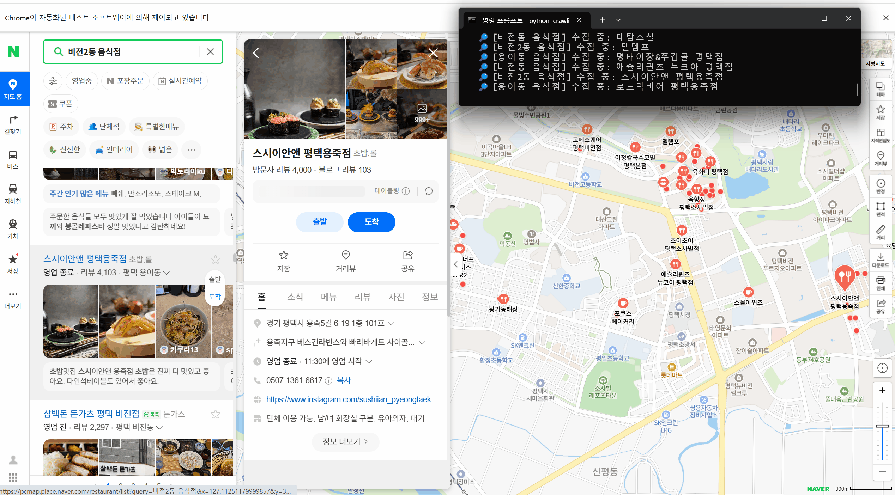
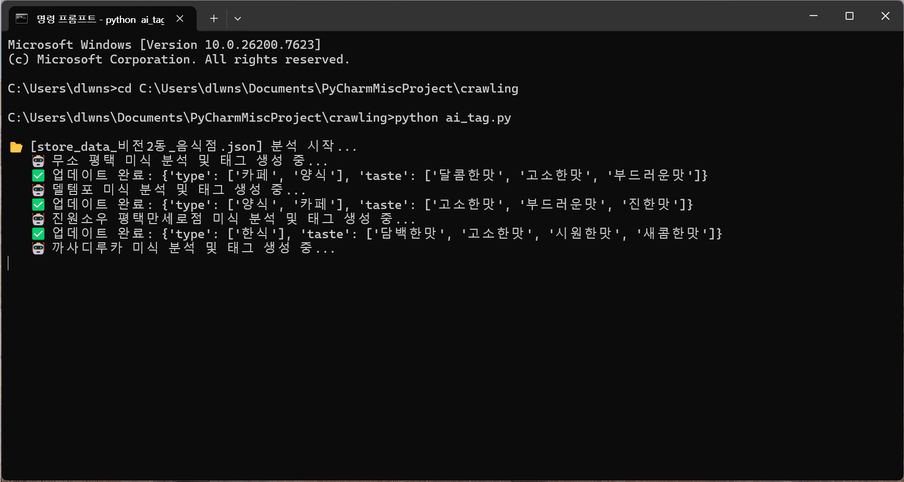
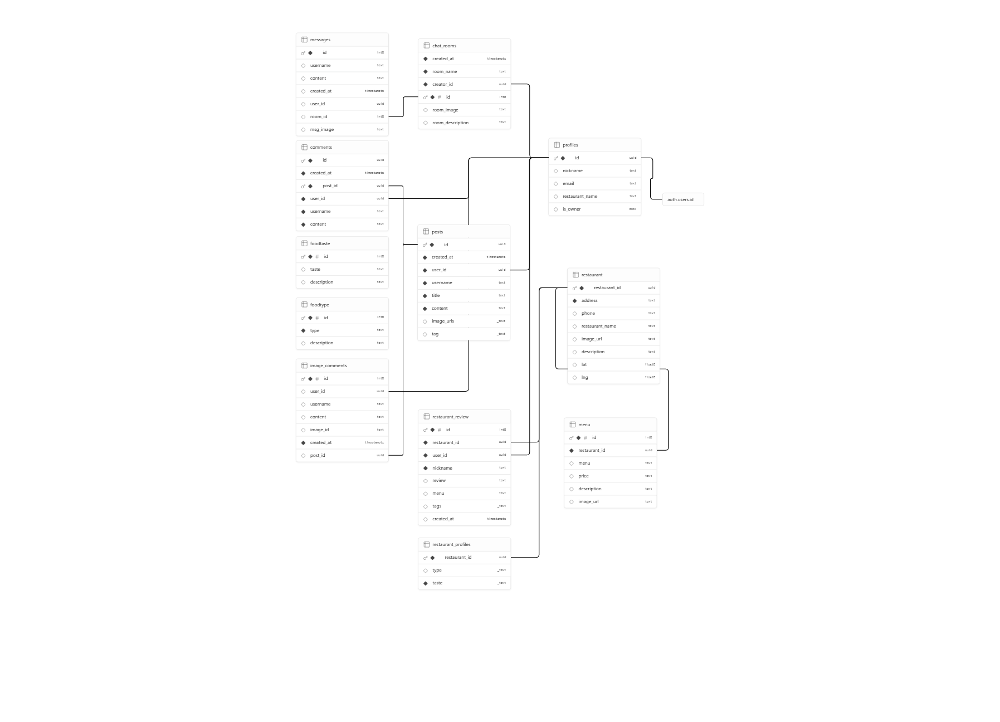

#  피티스푼 (PTspoon)
> **평택대학교 학생들을 위한 맛집 추천 및 로컬 커뮤니티 서비스**

**피티스푼**은 학교 주변의 숨은 맛집을 찾고, 학우들과 실시간으로 소통할 수 있는 웹 플랫폼입니다.  
사용자 취향 기반의 식당 추천부터 지도 탐색, 실시간 채팅, 그리고 AI 챗봇 '피투'까지 다양한 기능을 제공합니다.

 

### **배포 주소:** [https://restaurant-find-one.vercel.app](https://restaurant-find-one.vercel.app)

 

## 🛠️ Tech Stack

 

## 👥 Developers (개발팀)

초기 서비스는 아래 3인이 함께 개발했습니다. 학과 공모전 이후 후속 대회 준비와 추가 기능 개발은 **이준희가 단독으로 진행**했습니다. 아래 이준희의 담당 항목에는 초기 구현과 후속 고도화가 함께 포함돼 있습니다.

<table width="100%">
  <thead>
    <tr>
      <th width="33%" align="center">👑 PM · AI & Full Stack</th>
      <th width="34%" align="center">🧩 Core Logic & Map</th>
      <th width="33%" align="center">💻 Sub Developer · Branding & QA</th>
    </tr>
  </thead>
  <tbody>
    <tr>
      <td align="center">
        
      </td>
      <td align="center">
        
      </td>
      <td align="center">
        
      </td>
    </tr>
    <tr>
      <td align="center">
        <b>이준희</b> 
        팀장 / AI·풀스택 개발  
        
          프로젝트 총괄·시스템 아키텍처·DB 설계 
          DB 기반 2단계 AI 추천·요청 제한 
          식당 수집·AI 태깅·DB 적재 자동화 
          게시글·태그·점주 공지·채팅 공유 
          인증·마이페이지·회원 탈퇴 
          위치 데이터 DB 저장을 통한 거리 표시 개선 
          사용자 공개·조사 및 후속 대회 준비·고도화 단독 진행
        
      </td>
      <td align="center">
        <b>서승진</b> 
        메인 개발자 / 핵심 로직 구현  
        
          음식 필터링·AND/OR 핵심 로직 
          초기 지도·거리 기능 전체 개발 
          식당 목록·상세·리뷰 구현 
          검색 자동완성·공통 컴포넌트 
          식당 해시태그 상세 연결
        
      </td>
      <td align="center">
        <b>김윤정</b> 
        서브 개발자 / 브랜딩·QA  
        
          실시간 채팅 구현·개선 
          채팅방 관리·이미지 전송 
          ERD 설계 지원·디자인 피드백 
          브랜딩·사용자·점주 조사 
          QA·엣지 케이스 테스트
        
      </td>
    </tr>
    <tr>
      <td align="center">
        
      </td>
      <td align="center">
        
      </td>
      <td align="center">
        
      </td>
    </tr>
  </tbody>
</table>

 

## 팀원별 상세 담당

### 이준희 — 팀장 / AI·풀스택 개발

#### 시스템 설계

- Next.js 전역 레이아웃 및 구조 설계
- Supabase 데이터베이스 설계 (ERD)
- OAuth 인증 흐름 설계
- 상단바, 네비게이션바 컴포넌트 제작

#### AI·데이터 및 서비스 개발

- OpenAI 기반 맛집 추천 챗봇
- 사용자 조건 분석 → DB 후보 조회 → 답변 생성의 2단계 AI 추천 구조
- Upstash Redis 기반 AI 요청 횟수 제한 및 TTL 차단 로직 구현
- 게시글·식당의 채팅방 공유 및 상세 정보 연결
- 식당 위치 데이터 DB 사전 저장으로 거리 표시 속도 개선
- 게시글 목록·작성·상세 페이지
- 게시글 태그 및 태그별 조회 기능
- 점주용 공지·할인·가게소식 작성 기능
- 식당 공지와 전체 게시판 동시 노출
- 로그인/회원가입 페이지
- 마이페이지 및 내 게시글·댓글·리뷰·채팅방 조회
- 회원 탈퇴 및 세션 종료 처리
- 지역별 식당 크롤링·정제 자동화
- AI 맛 종류·특징 태깅 및 DB 적재 흐름 구축

#### 프로젝트 운영·후속 고도화

- 후속 대회 준비·추가 기능 개발 단독 진행
- 에브리타임 서비스 공개·구글폼 사용자 조사
- 개발 일정·기능 우선순위 조율
- 기능별 브랜치 및 GitHub Projects 작업 관리
- 알파 테스트 및 버그 수정
- 모바일 최적화

### 서승진 — 메인 개발자 / 핵심 로직 구현

#### 검색·필터링 로직

- 음식 카테고리·맛 특징 기반 식당 필터링
- 여러 필터 조건을 조합하는 AND/OR 로직 구현
- AND: 선택한 맛 특징을 모두 만족하는 식당 조회
- OR: 선택한 맛 특징 중 하나 이상 포함하는 식당 조회
- 페이지 간 검색·필터 상태 관리
- 식당명·게시글 검색 자동완성
- 채팅의 `#식당이름` 해시태그를 식당 상세 페이지로 연결

#### 초기 지도·거리 기능

- 초기 지도 기능 전체 개발
- 현재 위치 조회 및 지도 이동 기능
- 현재 위치 기반 식당 거리 계산·표시 초기 구현
- 식당 마커 표시·클러스터링
- 지도 인터랙션 및 식당 정보 바텀시트

#### 식당 화면·공통 컴포넌트

- 검색·필터·메뉴·맛 선택 등 UI 컴포넌트 구현
- 식당 목록 페이지 구현
- 식당 상세 페이지 구현
- 리뷰 작성 페이지 및 작성 흐름 구현
- 리뷰의 메뉴·맛 특징 선택 및 저장

### 김윤정 — 서브 개발자 / 브랜딩·QA

#### 채팅 기능

- 채팅방 목록/생성 페이지 구현
- 실시간 채팅 기능 구현·개선
- 카카오톡 스타일 메시지 UI
- 채팅 이미지 첨부·미리보기·전송
- 채팅방 이미지·설명 등록
- 본인이 만든 채팅방 삭제 기능

#### 브랜딩

- 자체 캐릭터(피투) 및 로고 디자인

#### 설계 지원·디자인 피드백

- ERD 설계 지원
- 사이트 디자인에 대한 지속적인 검토와 개선 의견 제안
- 주변 사용자의 디자인 피드백 수집·전달

#### 사용자 조사·QA

- 베타 테스터 모집 및 운영
- 엣지 케이스 테스트 수행
- 사용자 피드백 수집 및 개선
- 점주 인터뷰 및 홍보 요구 조사

 

## 🏆 Awards
* **TEAM UP! LIS Project 최우수상 수상**
* **정보통신학과 공모전 우수상 수상**

### 수상으로 이어진 서비스 발전 과정

피티스푼은 팀이 공모전에서 초기 서비스를 선보인 뒤, 이준희가 후속 대회 준비와 추가 기능 개발을 단독으로 이어갔습니다. 학생 대상 공개·조사와 김윤정이 진행한 점주 인터뷰 내용을 바탕으로 서비스를 고도화했습니다.

#### 1. 맛집 탐색과 커뮤니티를 연결한 초기 출시 — 정보통신학과 공모전 우수상

맛 종류·특징 필터, 지역 지도, 게시글, 실시간 채팅방과 AI 맛집 추천 기능을 구현했습니다. 학교 주변 식당을 찾고 학우들과 정보를 나눌 수 있는 서비스를 정보통신학과 공모전에서 시연해 **우수상**을 받았습니다.

#### 2. 학생들에게 서비스를 공개하고 개선 요구 수집

공모전 이후 **이준희가 에브리타임에 사이트 주소를 공개**하고, 구글폼으로 만족도와 개선 의견을 수집했습니다. 학교 주변 식당 데이터와 지역 범위를 넓혀 달라는 요청, 현재 위치에서의 거리 확인, 식당·게시글 공유, 게시글 유형 구분 등의 요구를 확인했습니다. **김윤정이 진행한 점주 인터뷰**에서는 광고 비용과 가게 소식의 노출에 대한 고민을 파악했습니다.

#### 3. 피드백을 반영한 지역·커뮤니티·AI 기능 확장 — TEAM UP! LIS Project 최우수상

이준희가 피드백을 바탕으로 개선 우선순위를 정하고, **아래 추가·개선 기능을 모두 직접 개발**했습니다. 점주용 기능은 김윤정에게 공유받은 인터뷰 내용을 바탕으로 구현했습니다.

| 확인한 요구·문제 | 반영한 개선 |
| --- | --- |
| 식당 정보가 부족하고 비전동까지 포함되면 좋겠다는 요청 | 용이동·비전1·2동으로 데이터를 확대하고, 지역 입력부터 식당 수집·정제·AI 맛 태깅·DB 적재까지 이어지는 자동화 흐름 구축 |
| 현재 위치에서 식당까지의 거리 확인 | 서승진이 구현한 초기 거리 계산·표시 기능을 바탕으로, 이준희가 식당 위치 데이터를 DB에 미리 저장해 더 빠르게 표시하도록 개선 |
| 찾은 식당과 게시글을 다른 학생에게 공유하고 싶다는 요청 | 식당·게시글을 실시간 채팅방에 공유하고 상세 정보로 이동하도록 연결 |
| 혼밥 정보와 행사·홍보·가게 소식을 구분하고 싶다는 요청 | 혼밥·행사·홍보·가게소식 태그와 태그별 게시글 조회 추가 |
| 점주의 광고 비용·가게 소식 노출에 대한 고민 | 점주가 식당을 연결해 공지·할인·가게소식을 작성하면 식당 공지와 전체 게시판에 함께 노출 |
| AI가 서비스에 등록되지 않은 식당을 추천하는 문제 | 사용자 조건을 분석한 뒤 실제 DB 후보를 조회하고, 해당 후보를 답변 근거로 전달하는 2단계 추천 구조 적용 |

거리 표시는 화면의 현재 위치 기능에 대한 설명이며, AI 챗봇의 거리 조건은 평택대학교 좌표를 기준으로 계산합니다. AI 추천은 DB 후보를 근거로 제공해 잘못된 추천 가능성을 줄이도록 개선한 것으로, 최종 응답의 오류를 완전히 차단한다는 의미는 아닙니다.

이준희가 초기 팀 프로젝트를 바탕으로 사용자 공개·조사, 추가 기능 개발과 후속 대회 준비를 단독으로 진행했고, 이 개선 버전으로 **TEAM UP! LIS Project 최우수상**을 받았습니다.

 

## 🚀 Key Features

### 1️⃣ 로그인/회원가입 기능
| 로그인/회원가입 페이지(카카오톡 로그인 가능) | 
| :---: | 
|  | 
| 사용자가 원하는 방식으로 로그인/회원가입이 가능합니다. | 

 

### 2️⃣ 메인 & 식당 카테고리 필터와 리뷰 기능
| 메인 페이지 (카테고리 선택) | 
| :---: | 
|  | 
| 사용자의 취향(한식, 중식 등)과 특징(매콤한 맛 등)에 따라 메뉴를 추천합니다. OR 필터는 맛의 특징이 1개라도 포함이 되어있으면,  AND 필터는 맛의 특징이 모두 포함이 된 식당들만 표시됩니다. | 

|  식당 페이지 (리뷰 기능) | 
| :---: | 
|  | 
| 전체 식당 목록에서 원하는 식당을 클릭하여 정보 확인과 리뷰작성이 가능합니다. | 

 

### 3️⃣ 지도 기능
| 지도 페이지(실시간 위치, 필터링 기능) | 
| :---: | 
|  | 
| 실시간 나의 위치로 주변 식당 정보와 필터링 기능을 사용할 수 있습니다. 왼쪽 아래의 버튼으로 평택대와 내 위치로 이동 가능합니다. | 

 

### 4️⃣ 소통 (게시글)
| 전체 게시글(실시간) | 
| :---: |
|  | 
| 게시글 페이지에서 게시글을 작성하거나 실시간으로 업로드되는 글을 볼 수 있습니다. | 

| 게시글 상세 | 
| :---: |
|  | 
| 게시글을 더블 클릭 시 댓글과 이미지 마다 댓글을 달 수 있습니다. | 

 

### 5️⃣ 소통 (채팅)
| 채팅방 목록 및 생성 | 
| :---: |
|  | 
| 채팅방 페이지에서는 채팅방을 생성하거나 들어갈 수 있습니다. | 

| 채팅방 페이지 | 
| :---: |
|  | 
| 채팅방으로 실시간으로 대화하며 정보를 공유할 수 있습니다. | 

 

### 6️⃣ 소통 (공유)
| 태그 기능 | 
| :---: |
|  | 
| 게시글에 태그를 넣어 다른 사람들에게 필요한 정보를 주거나 얻을 수 있습니다. | 

| 게시글 공유 | 
| :---: |
| | 
| 채팅방으로 게시글을 공유하여 정보를 보내거나 받을 수 있습니다. | 

| 식당 공유 | 
| :---: |
|  | 
| 괜찮은 식당의 정보를 채팅방에 전송을 할 수 있습니다. | 

| 사장님의 공유 | 
| :---: |
|  | 
| 가게의 사장님이 자신의 식당 태그를 누르고 작성을 하면 자동으로 식당 공지사항으로 올라갑니다. | 
 

### 7️⃣ 소통 (AI 피투)
| AI 피투 채팅방 |
| :---: | 
|  | 
| 무엇을 먹을지 고민될 땐 AI 챗봇 '피투'에게 물어보세요! | 

 

### 8️⃣ 내 정보
| 내 정보 |
| :---: | 
|  | 
| 마이 페이지에서 내가 작성한 모든 글들을 확인 가능합니다. | 

 

### 9️⃣ 데이터 수집 및 태그 자동화

식당 데이터 수집과 태그 작업을 자동화하는 과정을 소개합니다. 아래 GIF는 실제 실행 과정을 보여주는 시연 영상입니다.

| 데이터 수집 자동화 |
| :---: |
|  |
| 식당 데이터를 자동으로 수집하는 과정을 보여줍니다. |

| 태그 자동화 |
| :---: |
|  |
| 태그 작업을 자동으로 처리하는 과정을 보여줍니다. |

 

## 🗄️ Database Design (ERD)

| Supabase 데이터베이스 설계 |
| :---: |
|  |
| 식당·메뉴·리뷰, 사용자 프로필, 게시글·댓글, 채팅방·메시지의 테이블 구조와 외래 키 관계입니다. 이미지를 클릭하면 원본 크기로 확인할 수 있습니다. |
